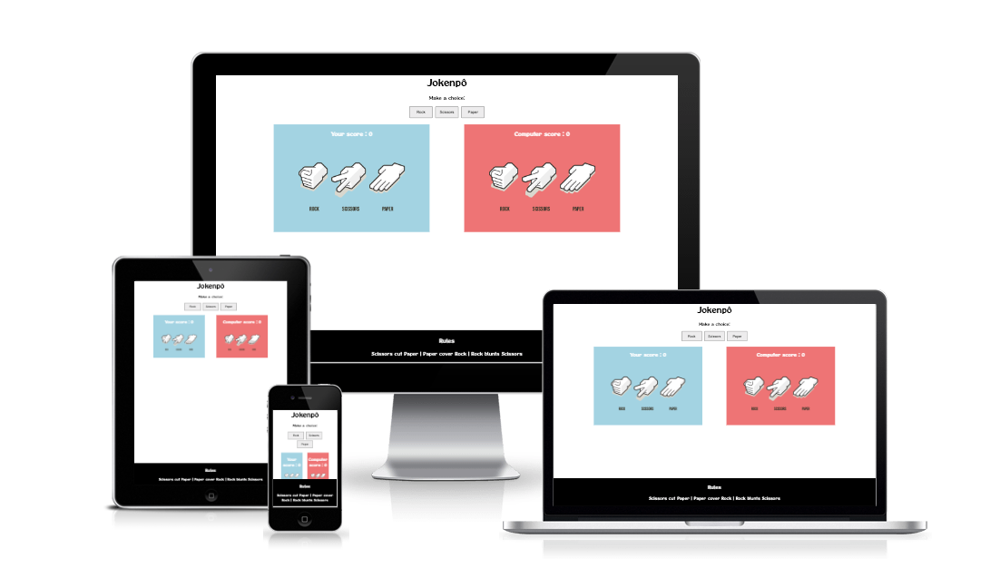

# Jokenpô
 
Project developed for the Full Stack Developer - Code Institute course, using HTML, CSS and JavaScript to build a game.
 
 
Jokenpô is a game to help frinds, collegues and family members make decisions with a simple game that has a truly random result. It has been shown that people familier with each other are statiscally more likely to draw when playing Rock Paper and Scissors. As the computer player in Jokenpô chooses randomly, the result of the game give a fairer result that playing with ones hands.
 
 
Users of this game will learn the rules of Rock Paper and Scissosrs so thay can apply it to decision making with others in their lives. This site will be traget towards adults and children alike as a simple app to learn, pratice and have fun with.
 
 

 
 

## Features

 

### Existing Features

 

* #### Header
  
  - Featured at the top of the page, the header shows the game name: Jokenpô in a font that is playful and clearly contrasts with the background.
  - This header clerly tells the user what game they are playing.
 
  
   
   

* #### The Game Options
  
  - The Game options include a clear instruction and the a choice of options to choose from to play: Rock, Paper or Scissors. These options are interactive buttons that the user can click to make their choice.
  - This section provides interactive buttons that the user can click to make their choice and play the game.
   
  
   
   

* ### The Game Results

  - When the user clicks an option, the image relating to their choice is shown on their side of the game board.
  - The JavaScript code chooses a random option for the Computer player, displays the image relating to the computer's choice, and the determines who the winner is.
  - The winner is announced to the user under the options button, and the score is update for either the user or the computer, depending on who won.
  - The results and score are clar to the user, making the game easy to play, understand who won, and what the score is.
     
  
 
 

* ### The Footer
  - The footer section shows the rules of Rock Paper and Scissors.
  - The footer is valuable to the user because it clearly explains how the game is played.
       
  
 
 

* ## Features Left to Implement
  - A Ranking with the placement of the last 3 players in arcade style. 
 
 

[Back to the top](#Jokenpô)

## Testing

  - I tested playing this game in different browsers: Chrome, Safari, Opera.
  - I confirmed that the game results are always correct.
  - I confirmed that the header, instructions, opt ioons, results and footer text are all readable and easy to understand.
  - I confirmed the the colors and fonts chosen are easy to read and accessible by running it through lighthouse in devtools.
   
  
   
  - No errors were returned when passing through the official [W3C validator](https://validator.w3.org/#validate_by_input). 
   
  
   
  - No errors were found when passing through the official [(Jigsaw) validator](https://jigsaw.w3.org/css-validator/).
   
  
   
  - I confirmed that this project is responsive, looks good and functions on all standard screen sizes using the devtools device toolbar.
   

## Bugs
### Unfixed Bugs
No unfixed bugs
 

## Deployment
- The site was deployed to GitHub pages. The steps to deploy are as follows:
- In the GitHub repository, navigate to the Settings tab
- From the source section on the left menu, select the Pages
- From the source section drop-down menu, select the Main Branch
- Once the main branch has been selected and the save button pressed, the page will be automatically refreshed with a detailed ribbon display to indicate the successful deployment.
The live link can be found here - (https://pembarach.github.io/Jokenpo/).
 

## Credits
- ### Content
  - The HTML and CSS code were acquired along with the content provided in the course above, in the Projecr class Portfolio > Portfolio 2 > Portfolio Project Scope.

- ### Media
  - The images used on the game are from [This Site](https://towardsdatascience.com/building-a-rock-paper-scissors-ai-using-tensorflow-and-opencv-d5fc44fc8222).
 

[Back to the top](#Jokenpô)